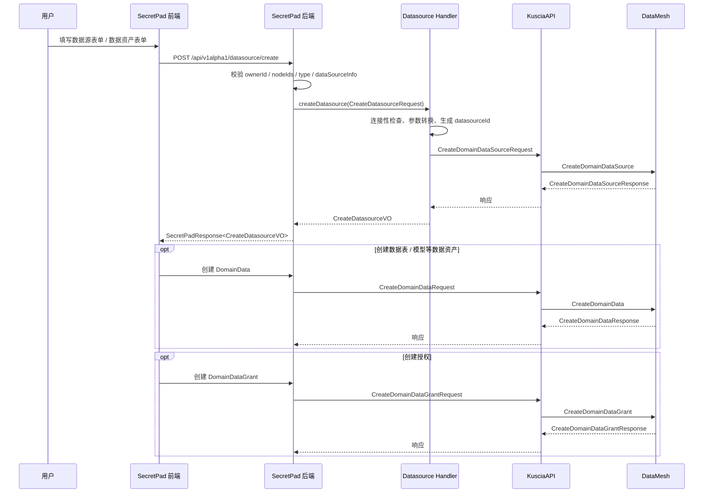
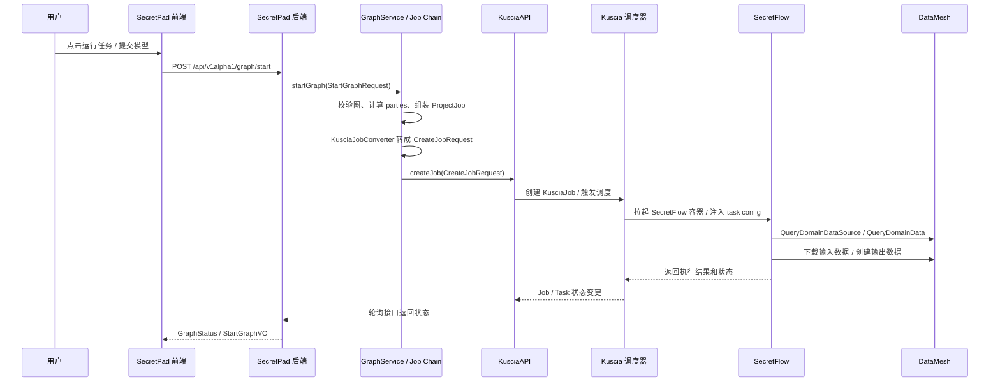

# 从secretpad前端到secretflow的完整数据流流程

本文档详细描述了从secretpad前端项目发起datamesh数据建立、联邦学习任务的完整数据流，从secretpad前端项目到secretpad后端项目，到kuscia项目到datamesh项目到secretflow项目的完整流程。

## 1. 整体架构概述

```
Frontend (React/AntD) -> Secretpad Backend (Spring Boot) -> Kuscia (Go) -> DataMesh (Go) -> SecretFlow (Python)
```

## 2. 数据流详细流程

### 2.1 前端发起数据上传和任务创建请求

#### 2.1.1 前端页面交互
- 用户在secretpad前端平台进行以下操作：
  1. 上传原始数据文件
  2. 创建DomainDataSource（数据源定义）
  3. 创建DomainData（数据表定义）
  4. 配置联邦学习任务参数
  5. 提交联邦学习任务

#### 2.1.2 前端API调用
- 前端位于：[/Users/charles/Documents/code/workspace/secretpad/frontend-src/apps/platform/src](file:///Users/charles/Documents/code/workspace/secretpad/frontend-src/apps/platform/src)
- API服务调用位于：[/Users/charles/Documents/code/workspace/secretpad/frontend-src/apps/platform/src/services/secretpad](file:///Users/charles/Documents/code/workspace/secretpad/frontend-src/apps/platform/src/services/secretpad)
- 前端通过HTTP/HTTPS向后端发起REST API请求，主要包括：
  - `/api/v1alpha1/datamesh/domaindatasource` - 创建数据源
  - `/api/v1alpha1/datamesh/domaindata` - 创建数据表
  - `/api/v1alpha1/job` - 创建联邦学习任务

### 2.2 Secretpad后端处理

#### 2.2.1 后端架构
- 项目结构：
  - [secretpad-web](file:///Users/charles/Documents/code/workspace/secretpad/secretpad-web) - Web API层
  - [secretpad-service](file:///Users/charles/Documents/code/workspace/secretpad/secretpad-service) - 业务逻辑层
  - [secretpad-persistence](file:///Users/charles/Documents/code/workspace/secretpad/secretpad-persistence) - 数据持久化层
  - [secretpad-common](file:///Users/charles/Documents/code/workspace/secretpad/secretpad-common) - 通用工具类

#### 2.2.2 API控制器
- 后端API控制器位于：[/Users/charles/Documents/code/workspace/secretpad/secretpad-web/src/main/java/org/secretflow/secretpad/web](file:///Users/charles/Documents/code/workspace/secretpad/secretpad-web/src/main/java/org/secretflow/secretpad/web)
- 主要控制器：
  - [DatameshController.java](file:///Users/charles/Documents/code/workspace/secretpad/secretpad-web/src/main/java/org/secretflow/secretpad/web/controller/v1alpha1/datamesh/DatameshController.java) - 处理数据网格相关请求
  - [JobController.java](file:///Users/charles/Documents/code/workspace/secretpad/secretpad-web/src/main/java/org/secretflow/secretpad/web/controller/v1alpha1/job/JobController.java) - 处理任务相关请求

#### 2.2.3 业务逻辑层
- 业务逻辑位于：[/Users/charles/Documents/code/workspace/secretpad/secretpad-service/src/main/java/org/secretflow/secretpad/service](file:///Users/charles/Documents/code/workspace/secretpad/secretpad-service/src/main/java/org/secretflow/secretpad/service)
- 关键服务：
  - [DatameshService.java](file:///Users/charles/Documents/code/workspace/secretpad/secretpad-service/src/main/java/org/secretflow/secretpad/service/datamesh/DatameshService.java) - 数据网格服务
  - [JobService.java](file:///Users/charles/Documents/code/workspace/secretpad/secretpad-service/src/main/java/org/secretflow/secretpad/service/job/JobService.java) - 任务服务

#### 2.2.4 与Kuscia的交互
- 后端通过Kuscia API与Kuscia进行交互
- 使用Kuscia提供的客户端库：[client-java-kusciaapi](file:///Users/charles/Documents/code/workspace/secretpad/secretpad-api/client-java-kusciaapi)
- 主要交互包括：
  - 创建DomainDataSource资源
  - 创建DomainData资源
  - 创建KusciaJob资源

### 2.3 Kuscia处理流程

#### 2.3.1 Kuscia架构
- 项目路径：[/Users/charles/Documents/code/workspace/kuscia](file:///Users/charles/Documents/code/workspace/kuscia)
- 核心组件：
  - Agent - 节点代理
  - DataMesh - 数据网格服务
  - Scheduler - 任务调度器
  - Controllers - CRD控制器

#### 2.3.2 自定义资源定义(CRD)
- Kuscia定义了多种CRD资源：
  - [KusciaJob](file:///Users/charles/Documents/code/workspace/kuscia/pkg/crd/apis/kuscia/v1alpha1/kusciajob_types.go) - 联邦学习任务定义
  - [KusciaTask](file:///Users/charles/Documents/code/workspace/kuscia/pkg/crd/apis/kuscia/v1alpha1/kusciatask_types.go) - 任务实例定义
  - [DomainData](file:///Users/charles/Documents/code/workspace/kuscia/pkg/crd/apis/kuscia/v1alpha1/domaindata_types.go) - 数据表定义
  - [DomainDataSource](file:///Users/charles/Documents/code/workspace/kuscia/pkg/crd/apis/kuscia/v1alpha1/domaindatasource_types.go) - 数据源定义

#### 2.3.3 DataMesh组件
- DataMesh路径：[/Users/charles/Documents/code/workspace/kuscia/pkg/datamesh](file:///Users/charles/Documents/code/workspace/kuscia/pkg/datamesh)
- 核心服务：
  - [domaindata.go](file:///Users/charles/Documents/code/workspace/kuscia/pkg/datamesh/metaserver/service/domaindata.go) - 数据管理服务
  - [domaindatasource.go](file:///Users/charles/Documents/code/workspace/kuscia/pkg/datamesh/metaserver/service/domaindatasource.go) - 数据源管理服务
  - [operator.go](file:///Users/charles/Documents/code/workspace/kuscia/pkg/datamesh/metaserver/service/operator.go) - 操作符服务

#### 2.3.4 任务调度流程
1. Secretpad后端创建KusciaJob CRD
2. Kuscia的Job Controller监听到新Job创建事件
3. Job Controller根据依赖关系创建相应的KusciaTask
4. KusciaTask Controller负责实际的任务执行

### 2.4 SecretFlow集成

#### 2.4.1 SecretFlow与Kuscia集成
- 集成代码路径：[/Users/charles/Documents/code/workspace/secretflow/secretflow/kuscia](file:///Users/charles/Documents/code/workspace/secretflow/secretflow/kuscia)
- 主要组件：
  - [entry.py](file:///Users/charles/Documents/code/workspace/secretflow/secretflow/kuscia/entry.py) - 入口点
  - [task_config.py](file:///Users/charles/Documents/code/workspace/secretflow/secretflow/kuscia/task_config.py) - 任务配置
  - [datamesh.py](file:///Users/charles/Documents/code/workspace/secretflow/secretflow/kuscia/datamesh.py) - 数据网格集成

#### 2.4.2 任务执行流程
1. Kuscia Task Controller启动SecretFlow容器
2. SecretFlow通过Kuscia提供的配置信息获取任务参数
3. 通过DataProxy与DataMesh交互，获取输入数据
4. 执行联邦学习算法
5. 将结果写回DataMesh或本地存储
6. 更新任务状态

#### 2.4.3 通信协议
- 使用gRPC进行组件间通信
- DataMesh提供gRPC接口：[domaindata.proto](file:///Users/charles/Documents/code/workspace/kuscia/proto/api/v1alpha1/datamesh/domaindata.proto)
- KusciaTask使用gRPC接口：[kuscia_task.proto](file:///Users/charles/Documents/code/workspace/kuscia/proto/api/v1alpha1/kusciatask/kuscia_task.proto)

### 2.5 端到端时序图

#### 2.5.1 数据源和数据资产创建时序



#### 2.5.2 联邦学习任务提交和执行时序



## 3. 接口和数据结构

### 3.1 API接口定义

#### 3.1.1 前端到后端接口
```
POST /api/v1alpha1/datamesh/domaindatasource - 创建数据源
POST /api/v1alpha1/datamesh/domaindata - 创建数据表
POST /api/v1alpha1/job - 创建联邦学习任务
GET /api/v1alpha1/job/{jobId} - 查询任务状态
```

#### 3.1.2 后端到Kuscia接口
- 使用Kubernetes API风格的CRD操作
- 主要资源类型：
  - KusciaJob
  - KusciaTask
  - DomainData
  - DomainDataSource

### 3.2 数据结构定义

#### 3.2.1 KusciaJob数据结构
```go
type KusciaJobSpec struct {
    FlowID         string               `json:"flowID,omitempty"`  // 流程ID
    Initiator      string               `json:"initiator"`         // 发起方
    ScheduleMode   KusciaJobScheduleMode `json:"scheduleMode,omitempty"` // 调度模式
    MaxParallelism *int                 `json:"maxParallelism,omitempty"` // 最大并行度
    Tasks          []KusciaTaskTemplate  `json:"tasks"`            // 任务模板列表
}
```

#### 3.2.2 KusciaTask数据结构
```go
type KusciaTaskSpec struct {
    Initiator       string      `json:"initiator"`        // 发起方
    TaskInputConfig string      `json:"taskInputConfig"`  // 任务输入配置
    ScheduleConfig  ScheduleConfig `json:"scheduleConfig,omitempty"` // 调度配置
    Parties         []PartyInfo    `json:"parties"`        // 参与方信息
}
```

#### 3.2.3 DomainData数据结构
```go
type DomainDataSpec struct {
    RelativeURI    string            `json:"relative_uri"`      // 相对URI
    Type           string            `json:"type"`              // 数据类型
    DatasourceId   string            `json:"datasource_id"`     // 数据源ID
    Vendor         string            `json:"vendor"`            // 供应商
    Columns        []*DataColumnSpec `json:"columns"`           // 列定义
    FileFormat     pbv1alpha1.FileFormat `json:"file_format"` // 文件格式
}
```

#### 3.2.4 任务配置数据结构
```python
@dataclass
class KusciaTaskConfig:
    task_id: str                    # 任务ID
    task_cluster_def: ClusterDefine # 集群定义
    task_allocated_ports: AllocatedPorts # 分配端口
    task_progress_url: str          # 进度上报URL
    sf_node_eval_param: NodeEvalParam # SF节点评估参数
    sf_cluster_desc: SFClusterDesc # SF集群描述
    sf_storage_config: Dict[str, StorageConfig] # SF存储配置
```

  ### 3.3 接口字段对照表

  #### 3.3.1 创建数据源请求 CreateDatasourceRequest

  对应 SecretPad 后端接口 `/api/v1alpha1/datasource/create`，模型在 [CreateDatasourceRequest.java](file:///Users/charles/Documents/code/workspace/secretpad/secretpad-service/src/main/java/org/secretflow/secretpad/service/model/datasource/CreateDatasourceRequest.java)。

  | 字段 | 类型 | 含义 | 去向 |
  |---|---|---|---|
  | ownerId | string | 数据源所属 owner 或节点上下文 | 用于权限校验和资源归属 |
  | nodeIds | List<string> | 需要创建同一逻辑数据源的节点列表 | DatasourceHandler 按节点循环创建 |
  | type | string | 数据源类型，如 OSS、MYSQL、ODPS | 决定路由到哪个 handler |
  | name | string | 数据源显示名 | 传给 Kuscia DataMesh |
  | dataSourceInfo | 多态对象 | 连接参数，按 type 反序列化 | 转成 Kuscia 的 info 字段 |

  #### 3.3.2 创建数据源响应 CreateDatasourceVO

  | 字段 | 类型 | 含义 |
  |---|---|---|
  | datasourceId | string | SecretPad 统一生成的数据源 ID |
  | failedRecord | Map<string, string> | 哪些节点失败，以及失败原因 |

  #### 3.3.3 Kuscia 创建数据源请求 CreateDomainDataSourceRequest

  | 字段 | 类型 | 含义 |
  |---|---|---|
  | header | RequestHeader | 请求头 |
  | domain_id | string | 当前域 ID，也就是节点 ID |
  | datasource_id | string | 数据源 ID |
  | type | string | oss / mysql / odps / localfs 等 |
  | name | string | 显示名 |
  | access_directly | bool | 是否直连数据源，通常为 false |
  | info | DataSourceInfo | 具体连接信息 |

  #### 3.3.4 Kuscia 创建数据源响应 CreateDomainDataSourceResponse

  | 字段 | 类型 | 含义 |
  |---|---|---|
  | status | Status | 0 表示成功，非 0 表示失败 |
  | data | CreateDomainDataSourceResponseData | 结果对象 |
  | data.datasource_id | string | 创建成功的数据源 ID |

  #### 3.3.5 DomainDataSource 对象

  | 字段 | 类型 | 含义 |
  |---|---|---|
  | datasource_id | string | 数据源唯一 ID |
  | name | string | 数据源名 |
  | type | string | 数据源类型 |
  | status | string | Available / Unavailable |
  | info | DataSourceInfo | 连接信息对象 |
  | info_key | string | 密钥引用型配置 |
  | access_directly | bool | 是否绕过 DataProxy |

  #### 3.3.6 创建数据资产请求 CreateDomainDataRequest

  | 字段 | 类型 | 含义 |
  |---|---|---|
  | header | RequestHeader | 请求头 |
  | domaindata_id | string | 数据资产 ID，空时由服务端生成 |
  | name | string | 数据资产名 |
  | type | string | table / model / rule / report / unknown |
  | relative_uri | string | 相对 datasource 的路径 |
  | datasource_id | string | 所属数据源 |
  | attributes | map<string,string> | 扩展属性 |
  | partition | Partition | 分区信息 |
  | columns | repeated DataColumn | 表结构，table 类型通常必填 |
  | vendor | string | 数据产生方 |
  | file_format | FileFormat | CSV / ORC / binary 等 |

  #### 3.3.7 创建数据资产响应 CreateDomainDataResponse / 查询响应 QueryDomainDataResponse

  | 字段 | 类型 | 含义 |
  |---|---|---|
  | status | Status | 调用状态 |
  | data.domaindata_id | string | 数据资产 ID |
  | data.name | string | 数据名 |
  | data.type | string | 数据类型 |
  | data.relative_uri | string | 逻辑路径 |
  | data.datasource_id | string | 所属数据源 |
  | data.attributes | map<string,string> | 扩展属性 |
  | data.columns | repeated DataColumn | 结构信息 |
  | data.vendor | string | 数据产生方 |
  | data.file_format | FileFormat | 文件格式 |
  | data.author | string | 归属作者 |

  #### 3.3.8 创建授权请求 CreateDomainDataGrantRequest

  | 字段 | 类型 | 含义 |
  |---|---|---|
  | header | RequestHeader | 请求头 |
  | domaindatagrant_id | string | 授权关系 ID |
  | domaindata_id | string | 被授权的数据资产 ID |
  | grant_domain | string | 被授权域 |
  | limit | GrantLimit | 授权限制 |
  | description | map<string,string> | 额外说明 |

  #### 3.3.9 GrantLimit 字段

  | 字段 | 类型 | 含义 |
  |---|---|---|
  | expiration_time | int64 | 过期时间 |
  | use_count | int32 | 使用次数限制 |
  | flow_id | string | 任务流 ID |
  | components | repeated string | 可用组件列表 |
  | initiator | string | 发起方 |
  | input_config | string | 输入配置 |

  #### 3.3.10 StartGraphRequest

  对应 `/api/v1alpha1/graph/start`，模型在 [StartGraphRequest.java](file:///Users/charles/Documents/code/workspace/secretpad/secretpad-service/src/main/java/org/secretflow/secretpad/service/model/graph/StartGraphRequest.java)。

  | 字段 | 类型 | 含义 |
  |---|---|---|
  | projectId | string | 项目 ID |
  | graphId | string | 图 ID |
  | breakpoint | boolean | 是否断点续跑 |
  | nodes | List<string> | 选择要启动的图节点 |

  #### 3.3.11 StartGraphVO

  | 字段 | 类型 | 含义 |
  |---|---|---|
  | jobId | string | 本次启动生成的作业 ID |

  #### 3.3.12 ProjectJob

  `ProjectJob` 是 SecretPad 内部承上启下的对象，后端先把图解析成它，再转 Kuscia Job。

  | 字段 | 类型 | 含义 |
  |---|---|---|
  | projectId | string | 项目 ID |
  | graphId | string | 图 ID |
  | name | string | 图或作业名 |
  | jobId | string | 内部生成的作业 ID |
  | fullNodes | List<GraphNodeInfo> | 完整图节点 |
  | edges | List<GraphEdge> | 完整图边 |
  | tasks | List<JobTask> | 参与执行的任务 |
  | maxParallelism | Integer | 最大并行度 |

  ##### JobTask 字段

  | 字段 | 类型 | 含义 |
  |---|---|---|
  | taskId | string | 任务 ID |
  | parties | List<string> | 参与方列表 |
  | status | GraphNodeTaskStatus | 节点状态 |
  | dependencies | List<string> | 依赖任务 |
  | node | GraphNodeInfo | 对应的图节点 |

  #### 3.3.13 Kuscia CreateJobRequest

  | 字段 | 类型 | 含义 |
  |---|---|---|
  | header | RequestHeader | 请求头 |
  | job_id | string | 作业 ID |
  | initiator | string | 发起方 |
  | max_parallelism | int32 | 最大并行度 |
  | tasks | repeated Task | 任务列表 |
  | custom_fields | map<string,string> | 自定义字段 |

  ##### Task 字段

  | 字段 | 类型 | 含义 |
  |---|---|---|
  | app_image | string | 运行镜像 |
  | parties | repeated Party | 任务参与方 |
  | alias | string | 别名 |
  | task_id | string | 任务 ID |
  | dependencies | repeated string | 依赖任务 |
  | task_input_config | string | 任务输入配置 |
  | priority | int32 | 优先级 |
  | schedule_config | ScheduleConfig | 调度配置 |
  | tolerable | bool | 失败是否容忍 |

  ##### Party 字段

  | 字段 | 类型 | 含义 |
  |---|---|---|
  | domain_id | string | 域 ID |
  | role | string | server / client |
  | resources | JobResource | 资源限制 |
  | bandwidth_limits | repeated BandwidthLimit | 带宽限制 |

  #### 3.3.14 Kuscia CreateJobResponse

  | 字段 | 类型 | 含义 |
  |---|---|---|
  | status | Status | 调用结果 |
  | data.job_id | string | 创建成功的 job_id |

  #### 3.3.15 SecretFlow 数据接口

  `secretflow/secretflow/kuscia/datamesh.py` 中最常用的几个函数可以理解为读写 DataMesh 的接口：

  | 函数 | 作用 |
  |---|---|
  | get_domain_data_source | 查询 DomainDataSource |
  | get_domain_data | 查询 DomainData |
  | create_domain_data_in_dm | 创建 DomainData |
  | get_file_from_dp | 通过 DataProxy 下载文件 |
  | put_file_to_dp | 通过 DataProxy 上传文件 |

## 4. 关键代码流程分析

### 4.1 前端数据上传流程
1. 用户在前端页面上传数据文件
2. 前端通过API服务调用后端
3. 后端将文件存储到指定位置
4. 创建DomainDataSource和DomainData资源

### 4.2 联邦学习任务创建流程
1. 前端提交任务配置
2. 后端验证任务参数
3. 创建KusciaJob CRD
4. Kuscia Job Controller监听并处理
5. 创建对应的KusciaTask
6. Kuscia Task Controller启动SecretFlow任务
7. SecretFlow执行联邦学习算法
8. 更新任务状态和结果

### 4.3 数据流转过程
1. 原始数据上传到DataProxy
2. 通过DataMesh创建DomainData资源
3. 任务执行时，SecretFlow通过DataProxy读取数据
4. 计算结果写回指定位置
5. 通过DataMesh更新结果状态

## 5. 安全和权限控制

### 5.1 数据安全
- 通过DomainDataGrant实现数据授权
- 数据访问控制基于RBAC模型
- 数据传输加密

### 5.2 任务安全
- 任务隔离机制
- 资源配额限制
- 网络策略控制

## 6. 监控和日志

### 6.1 任务监控
- 任务状态跟踪
- 资源使用情况
- 执行进度监控

### 6.2 日志收集
- 组件日志统一收集
- 任务执行日志
- 错误追踪

## 7. 总结

该架构实现了从前端用户界面到后端执行引擎的完整联邦学习工作流，通过Kuscia作为协调层，整合了DataMesh数据管理和SecretFlow计算引擎，提供了端到端的隐私计算解决方案。